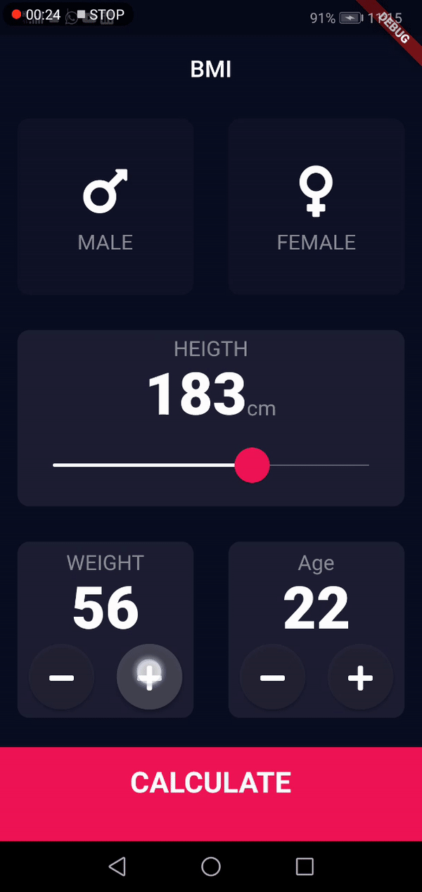

# bmi

A Flutter App that allow users to calculate their BMI(Body Mass Index), BMI is a measure of body fat based on height and weight that applies to adult men and women.
This project cover some basic Widgets in flutter.




## Getting Started

This project is a starting point for a Flutter application.

A few resources to get you started if this is your first Flutter project:

- [Lab: Write your first Flutter app](https://flutter.dev/docs/get-started/codelab)
- [Cookbook: Useful Flutter samples](https://flutter.dev/docs/cookbook)

For help getting started with Flutter, view our
[online documentation](https://flutter.dev/docs), which offers tutorials,
samples, guidance on mobile development, and a full API reference.

## Installation
Clone github repository, open with your IDE and get Dependencies 
```bash
git clone https://github.com/Onnys/BMI.git
flutter run
```

## License 
 Bmi is a public domain work, fell free to do whatever you want with it.
